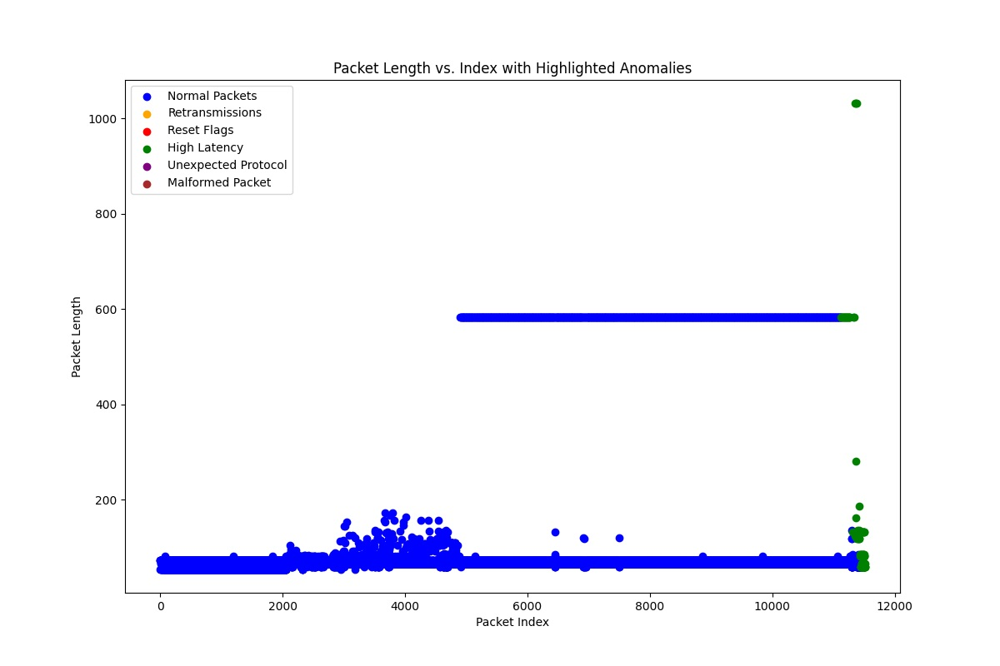

# Wireshark Capture Anomaly Detection and Analysis

This Python script analyzes Wireshark `.pcap` files to detect and classify network traffic anomalies using machine learning. It helps network engineers efficiently troubleshoot issues by identifying specific anomaly types, including retransmissions, reset flags, high latency, unexpected protocols, and malformed packets.

## Features

- **Feature Extraction**:
  - Extracts relevant details from `.pcap` files, such as:
    - Protocol type
    - Packet length
    - Source and destination IPs and ports
    - TCP retransmissions and reset flags
  - Ignores Layer 2 protocols like STP, ARP, and CDP to focus on meaningful data.

- **Anomaly Detection**:
  - Uses the Isolation Forest algorithm to identify anomalies in traffic patterns.
  - Anomalies are classified into detailed categories:
    - **Retransmission**: Detected packet retransmissions.
    - **Reset Flag**: TCP reset flag observed.
    - **High Packet Length**: Packets exceeding typical MTU size.
    - **High Latency**: Packets with unusually high timestamp values.
    - **Unexpected Protocol**: Protocols not typically seen or marked as unknown.
    - **Malformed Packet**: Packets with missing or invalid address information.

- **Visualization**:
  - Generates a scatter plot highlighting anomalies by type, providing an intuitive way to analyze traffic issues.

- **CSV Export**:
  - Saves anomalies to a CSV file (`analyzed_capture.csv`) for further review, including the anomaly type and packet details.

## Prerequisites

Ensure you have the following installed:

- Python 3.7+
- Required Python libraries:
  ```bash
  pip install pyshark pandas matplotlib scikit-learn
  ```

## Usage

1. Clone this repository or download the script.
2. Run the script:
   ```bash
   python wireshark_network_troubleshooting.py
   ```
3. Enter the path to your Wireshark `.pcap` file when prompted:
   ```
   Enter the path to the Wireshark capture file (.pcap): /path/to/your/capture_file.pcap
   ```
4. The script will:
   - Extract features from the capture file.
   - Detect and classify anomalies.
   - Display details of the detected anomalies.
   - Generate a visualization of anomalies.
   - Save the anomalies to a CSV file for further review.

## Example Output

### Anomaly Details (Terminal):
```plaintext
Abnormal Packet at Line 25:
  Protocol: TCP
  Length: 2000 bytes
  Source: 192.168.1.1:443
  Destination: 192.168.1.2:55234
  Anomaly Type: High Packet Length
  Reason: Packet length exceeds typical MTU size (1500 bytes). This could indicate fragmentation or unusually large payloads.
  Tip: Check the source application generating this traffic to ensure compliance with MTU standards.
```

### CSV Export:
The exported CSV file (`analyzed_capture.csv`) includes the following columns:
- Protocol
- Length
- Src_Address
- Dst_Address
- Src_Port
- Dst_Port
- Timestamp
- Retransmission
- Reset_Flag
- Anomaly
- **Anomaly_Type**

### Visualization:


A scatter plot is generated highlighting the anomalies by type (e.g., retransmissions, reset flags, high latency) with distinct colors for easy analysis.

## Customization

- **Anomaly Sensitivity**:
  - Adjust the `contamination` parameter in the Isolation Forest model to control anomaly detection sensitivity:
    ```python
    model = IsolationForest(contamination=0.05, random_state=42)
    ```
- **Ignored Protocols**:
  - Modify the `protocol` filtering in the `extract_features` function to include or exclude specific Layer 2 protocols.

## Known Limitations

- The script relies on the Isolation Forest algorithm, which may require tuning for specific network environments.
- High-volume captures may impact performance.

## License

This project is licensed under the MIT License. See the LICENSE file for details.

## Contributions

Contributions and feedback are welcome! Feel free to fork the repository, create issues, or submit pull requests to improve the script.


For any questions or feedback, please contact [mayank_nauni@mymail.sutd.edu.sg].
